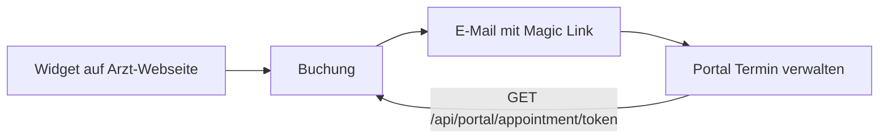

# Online Booking & Patient Portal – Masterplan

Diese Datei beschreibt die vollständige Implementierung der Online-Terminvergabe. Sie besteht aus zwei Komponenten, die nahtlos ineinandergreifen:

1. **Das Widget:** Einbettbarer Kalender für die Webseite des Arztes (Neukundengewinnung) – der „Eingang“.
2. **Das Portal:** Magic-Link-Bereich für Patienten zum Verwalten/Stornieren (ohne Login-Hürde) – die „Verwaltung“.

---

## Zusammenhang: Vom Widget zum Portal (Magic Link)

Der gleiche **managementToken** verbindet Buchung und Verwaltung:

1. Patient öffnet das Widget (z. B. auf www.arzt-mueller.at eingebettet) und bucht einen Termin.
2. Nach der Buchung (oder nach Double-Opt-In) erhält der Patient eine E-Mail mit dem Link: **„Termin verwalten: {FRONTEND_URL}/portal/appointment/{managementToken}"**.
3. Derselbe Token ist am Appointment in der Datenbank gespeichert (`managementToken`, `managementTokenExpires`).
4. Klick auf den Link führt zur Portal-Seite; diese ruft `GET /api/portal/appointment/:token` auf und zeigt Termindaten, Storno-Button und .ics-Export.

So ist der Prozess „aus einem Guss“: Eine Buchung (Widget) erzeugt einen Token, die E-Mail liefert den Link, das Portal nutzt denselben Token für Anzeige und Storno.

---

## TEIL 1: Das Widget (Der „Eingang“)

Ziel: Einbettung per iFrame auf z. B. www.arzt-mueller.at ermöglichen.

### 1. Backend Security (CORS und Frame-Einbettung)

- [x] **Datei:** [backend/server.js](backend/server.js)
- [x] **CORS:** Für alle Routen unter `/api/online-booking/` wird `Access-Control-Allow-Origin` auf den Request-Origin oder `*` gesetzt; OPTIONS-Anfragen erhalten 204.
- [x] **Frame-Einbettung:** Nicht im Backend (Helmet unverändert), sondern in **Nginx**: Für die Frontend-Route `/booking/widget` setzt Nginx `Content-Security-Policy: frame-ancestors *`, damit das Widget in beliebigen Domains eingebettet werden kann. Siehe [PRODUCTION_DEPLOYMENT.md](../PRODUCTION_DEPLOYMENT.md) (Abschnitt Nginx, `location /booking/widget`).

### 2. Frontend „Naked“ Route

- [x] **Route:** `/booking/widget/:doctorId` in [frontend/src/App.tsx](frontend/src/App.tsx) (öffentliche Route, ohne Layout).
- [x] **Komponente:** [frontend/src/pages/BookingWidgetPage.tsx](frontend/src/pages/BookingWidgetPage.tsx) – weißer Hintergrund, 100 % Breite/Höhe, kein Header/Footer („naked“). Es gibt kein separates `WidgetLayout.tsx`; die Seite rendert nur eine Box mit der Buchungskomponente.
- [x] **Buchungslogik:** Die bestehende Komponente `OnlineBooking` wird mit `initialDoctorId={doctorId}` und `widgetMode={true}` genutzt; sie ist responsiv und funktioniert auch in schmalen iFrames (z. B. 350px Breite).

### 3. Code-Generator für den Arzt

- [x] **Ort:** Einstellungen → Allgemein → Karte „Online-Buchung Widget“ in [frontend/src/pages/Settings.tsx](frontend/src/pages/Settings.tsx).
- [x] **Feature:** Arzt wird per Dropdown ausgewählt; das persönliche iframe-Snippet wird dynamisch erzeugt (Basis-URL aus `REACT_APP_PUBLIC_URL`, `REACT_APP_FRONTEND_URL` oder `window.location.origin`).
- [x] **Snippet (Beispiel):**  
  `<iframe src="https://app.DEINE-DOMAIN.at/booking/widget/{DOCTOR_ID}" style="width: 100%; height: 700px; border: none;" title="Terminbuchung"></iframe>`
- [x] **Kopier-Button:** „In Zwischenablage kopieren“ für das generierte Snippet.

**Konkrete Dateien (TEIL 1):** `backend/server.js`, `frontend/src/App.tsx`, `frontend/src/pages/BookingWidgetPage.tsx`, `frontend/src/pages/Settings.tsx`, `PRODUCTION_DEPLOYMENT.md`.

---

## TEIL 2: Das Patient Portal (Die „Verwaltung“)

Ziel: Patienten verwalten Termine über einen sicheren Link aus der E-Mail (Magic Link).

### 4. Backend Token-Logik (Magic Link)

- [x] **Schema:** [backend/models/Appointment.js](backend/models/Appointment.js) – Felder `managementToken` (String, indexiert, unique sparse) und `managementTokenExpires` (Date, indexiert).
- [x] **Erzeugung:** In [backend/routes/onlineBooking.js](backend/routes/onlineBooking.js) – bei Erstellung eines Termins (sofortige Buchung und nach Double-Opt-In-Verifizierung) wird ein Token mit `crypto.randomBytes(32).toString('hex')` gesetzt; Ablauf z. B. 90 Tage nach Terminende.
- [x] **Portal-API:** [backend/routes/patientPortal.js](backend/routes/patientPortal.js):
  - `GET /api/portal/appointment/:token` – gibt Termin-Details zurück (nur Datum, Zeit, Arzt, Adresse, Buchungsnummer, Status; keine sensiblen Diagnosen).
  - `POST /api/portal/appointment/:token/cancel` – storniert den Termin (unter Beachtung von Stornierungsfrist und SystemSettings).
- [x] **Rate-Limit:** In [backend/server.js](backend/server.js) ist für `/api/portal` ein Limiter konfiguriert (10 Anfragen pro IP und Minute).

### 5. Notification Service (Die Brücke)

- [x] **E-Mail:** Das Template der Terminbestätigung in [backend/routes/onlineBooking.js](backend/routes/onlineBooking.js) (Funktion `sendConfirmationEmail`) wurde angepasst.
- [x] **Inhalt:** Der Link „Termin verwalten: {FRONTEND_URL}/portal/appointment/{managementToken}“ wird in HTML- und Plain-Text-Version der E-Mail eingefügt. `FRONTEND_URL` kommt aus der Umgebung (z. B. `process.env.FRONTEND_URL`).

### 6. Frontend Portal Page

- [x] **Route:** `/portal/appointment/:token` in [frontend/src/App.tsx](frontend/src/App.tsx) (öffentliche Route, ohne Layout).
- [x] **Komponente:** [frontend/src/pages/AppointmentManagementPage.tsx](frontend/src/pages/AppointmentManagementPage.tsx) – schlichtes, vertrauenswürdiges Layout (ohne separates `PortalLayout.tsx`).
- [x] **Features:**
  - Anzeige der Termindaten (Arzt, Datum/Uhrzeit, Adresse, Buchungsnummer, Status).
  - Button „Termin stornieren“ (ruft `POST /api/portal/appointment/:token/cancel` auf, mit Bestätigungsdialog).
  - Button „Zum Kalender hinzufügen“ (.ics-Download, Zeiten in UTC).
  - Seite setzt `meta robots noindex, nofollow` (keine Indexierung durch Suchmaschinen).
- [ ] **(Optional)** „Jetzt registrieren“-Upsell: Link zu einem zukünftigen Patienten-Konto, um alle Termine und Befunde zu sehen.

**Konkrete Dateien (TEIL 2):** `backend/models/Appointment.js`, `backend/routes/onlineBooking.js`, `backend/routes/patientPortal.js`, `backend/server.js`, `frontend/src/pages/AppointmentManagementPage.tsx`, `frontend/src/App.tsx`.

---

## Anweisungen für Cursor

1. **Diese Datei als zentrale Referenz** für den Gesamtprozess „Online Booking & Patient Portal“ nutzen. Widget (Eingang) und Portal (Verwaltung) gehören zusammen; der Magic Link verbindet sie.

2. **Bei Änderungen an Widget oder Portal:** Magic-Link-URL und Token-Logik konsistent halten:
   - E-Mail-Link immer: `{FRONTEND_URL}/portal/appointment/{managementToken}`.
   - Portal-Route im Frontend: `/portal/appointment/:token`.
   - Backend-API: `GET/POST /api/portal/appointment/:token` (bzw. `/cancel`).

3. **Details zu Storno, SystemSettings und Rate-Limit:** Siehe [docs/PATIENT_PORTAL.md](PATIENT_PORTAL.md).

4. **Nginx-Konfiguration** (frame-ancestors für Widget-Einbettung): Siehe [PRODUCTION_DEPLOYMENT.md](../PRODUCTION_DEPLOYMENT.md).

5. **Umsetzung:** Alle mit [x] markierten Punkte sind umgesetzt. Nur optionale Erweiterungen (z. B. eigenes PortalLayout, „Jetzt registrieren“-Upsell) sind als [ ] belassen.
